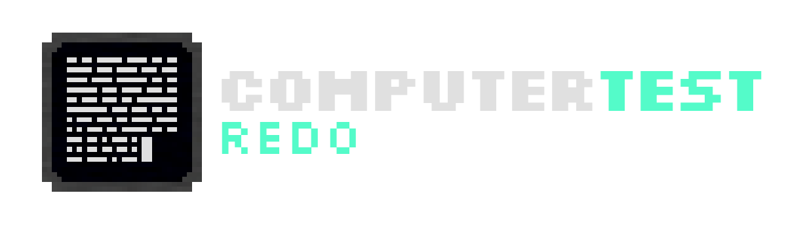

A comprehensive implementation of ComputerCraft in Minetest.

## License
+ [Code License](LICENSE)
+ [Assets License](textures/LICENSE)
+ [Documentation License](.docs/LICENSE)

<!-- 

### Code License

    This file is part of ComputerTest Redo.

    ComputerTest Redo is free software: you can redistribute it and/or modify it under the terms of the GNU Affero General Public License as published by the Free Software Foundation, either version 3 of the License, or (at your option) any later version.

    ComputerTest Redo is distributed in the hope that it will be useful, but WITHOUT ANY WARRANTY; without even the implied warranty of MERCHANTABILITY or FITNESS FOR A PARTICULAR PURPOSE. See the GNU Affero General Public License for more details.

    You should have received a copy of the GNU Affero General Public License along with ComputerTest Redo. If not, see <https://www.gnu.org/licenses/>.

    The license is included in the project root under the file labeled LICENSE. All files not otherwise specified under a different license shall be put under this license.

### Assets License

    This assets folder is licensed under the Creative Commons Attribution-ShareAlike
    4.0 International License (CC BY-SA 4.0).

    Copyright (C) 2023 James David Clarke

    To view a copy of this license, consult the 'LICENSE' file located in the 'assets' folder.

### Documentation License

    This is part of the ComputerTest Redo Documentation.

    Copyright (C) 2023 James David Clarke

    Permission is granted to copy, distribute and/or modify this document under the terms of the GNU Free Documentation License, Version 1.3 or any later version published by the Free Software Foundation; with no Invariant Sections, no Front-Cover Texts, and no Back-Cover Texts. A copy of the license is included in the 'LICENSE' file located in the 'docs' folder. -->
