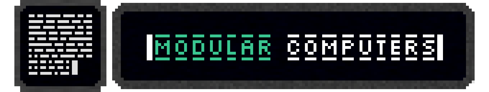

# Modular Computers

Welcome to the Modular Computers repository. A comprehensive implementation of Computers in Minetest.

## Features
+ Computer towers with a motherboard, CPU, GPU, RAM and hard drive in three tiers, and a monitor on top. More monitors beside and above it make the screen bigger.
+ A terminal with shell commands, a text editor, and Lua programs that run in a sandbox, with an API modelled on [OpenComputers](https://ocdoc.cil.li/): components, signals and events, files, GPU drawing in color, and more. See [programming computers](.docs/LUA_API.md).
+ Redstone input and output on every side of the tower, with mesecons or Mineclonia's redstone.
+ Cards: wireless cards to send messages between computers, internet cards for HTTP requests and data cards for hashing, encoding and compression.
+ Recipes for Minetest Game, Mineclonia and VoxeLibre.

## Server settings
+ `modular_computers.internet_enabled` lets internet cards make HTTP requests. The mod must also be listed in `secure.http_mods`. Requests to local networks are refused, but the server follows redirects, so set `modular_computers.internet_whitelist` to the hosts computers may use to be sure.
+ `modular_computers.memory_limit` (MiB, default 1024) stops the computer that allocated the most memory lately when the server's Lua memory grows past it. 0 turns this off.

## Documentation
For an in-depth understanding of the project, setting up the environment, and other related information, refer to our [documentation](.docs/).

## Contributing
We encourage community contributions to help improve Modular Computers. If you're looking to contribute, please check out the [CONTRIBUTING.md](./CONTRIBUTING.md) file for information on how to get started, coding standards, and guidelines.

## License
Each part of this project is licensed under specific terms. In cases where a file doesn't have a license notice or is not otherwise specified, it falls under the Fallback License. Below are the licensing details:

+ **Code**: The code is licensed under the terms provided in the [Code License file](LICENSE).
+ **Assets**: The assets are covered by the license specified in the [Assets License file](textures/LICENSE).
+ **Documentation**: The documentation is under the license mentioned in the [Documentation License file](.docs/LICENSE).
+ **Fallback License**: For files without a license notice or otherwise specified license, refer to the [Fallback License file](./LICENSE).
