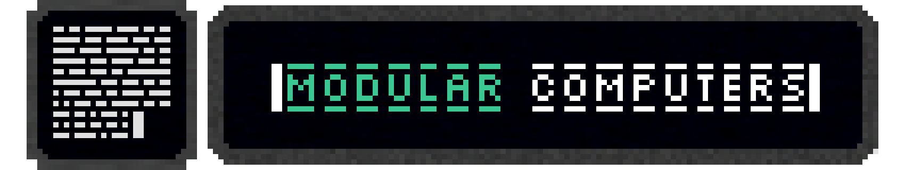

# Modular Computers

Welcome to the Modular Computers repository. A comprehensive implementation of Computers in Minetest.

## Documentation
For an in-depth understanding of the project, setting up the environment, and other related information, refer to our [documentation](.docs/).

## Contributing
We encourage community contributions to help improve Modular Computers. If you're looking to contribute, please check out the [CONTRIBUTING.md](./CONTRIBUTING.md) file for information on how to get started, coding standards, and guidelines.

## License
Each part of this project is licensed under specific terms. In cases where a file doesn't have a license notice or is not otherwise specified, it falls under the Fallback License. Below are the licensing details:

+ **Code**: The code is licensed under the terms provided in the [Code License file](LICENSE).
+ **Assets**: The assets are covered by the license specified in the [Assets License file](textures/LICENSE).
+ **Documentation**: The documentation is under the license mentioned in the [Documentation License file](.docs/LICENSE).
+ **Fallback License**: For files without a license notice or otherwise specified license, refer to the [Fallback License file](./LICENSE).
